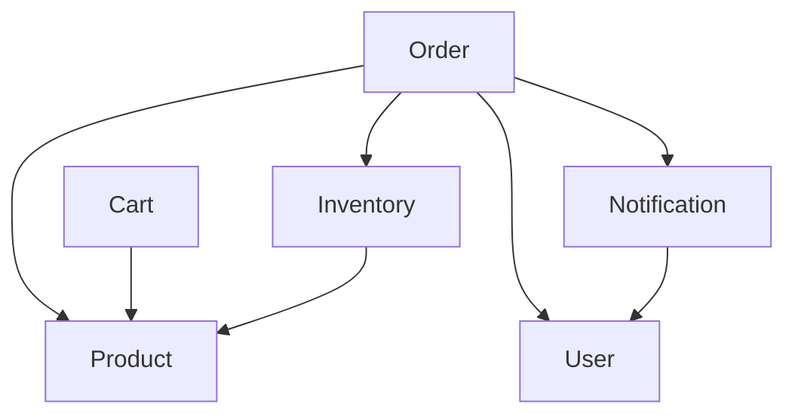

# Service Contracts: E-Commerce Platform

## 🎯 Overview
This document defines the API contracts and service specifications for all microservices in the e-commerce platform.

## 🔐 Auth Service

### Purpose
Handles user authentication, authorization, and JWT token management.

### API Endpoints
```yaml
# Authentication
POST /api/auth/register
POST /api/auth/login
POST /api/auth/refresh
POST /api/auth/logout
POST /api/auth/forgot-password
POST /api/auth/reset-password

# User Management
GET /api/auth/profile
PUT /api/auth/profile
GET /api/auth/users (admin only)
PUT /api/auth/users/{id}/roles (admin only)
```

### Data Models
```csharp
public class User
{
    public Guid Id { get; set; }
    public string Email { get; set; }
    public string FirstName { get; set; }
    public string LastName { get; set; }
    public List<string> Roles { get; set; }
    public DateTime CreatedAt { get; set; }
    public bool IsActive { get; set; }
}

public class LoginRequest
{
    public string Email { get; set; }
    public string Password { get; set; }
}

public class AuthResponse
{
    public string AccessToken { get; set; }
    public string RefreshToken { get; set; }
    public DateTime ExpiresAt { get; set; }
    public User User { get; set; }
}
```

### Events Published
- `UserRegistered`
- `UserLoggedIn`
- `UserLoggedOut`
- `PasswordResetRequested`

---

## 📦 Product Service

### Purpose
Manages product catalog, categories, search, and product information.

### API Endpoints
```yaml
# Product Management
GET /api/products
GET /api/products/{id}
POST /api/products (vendor/admin)
PUT /api/products/{id} (vendor/admin)
DELETE /api/products/{id} (vendor/admin)
GET /api/products/search?q={query}&category={category}

# Categories
GET /api/categories
GET /api/categories/{id}
POST /api/categories (admin)
PUT /api/categories/{id} (admin)
```

### Data Models
```csharp
public class Product
{
    public Guid Id { get; set; }
    public string Name { get; set; }
    public string Description { get; set; }
    public decimal Price { get; set; }
    public string SKU { get; set; }
    public Guid CategoryId { get; set; }
    public Guid VendorId { get; set; }
    public List<string> Images { get; set; }
    public ProductSpecs Specifications { get; set; }
    public bool IsActive { get; set; }
    public DateTime CreatedAt { get; set; }
    public DateTime UpdatedAt { get; set; }
}

public class Category
{
    public Guid Id { get; set; }
    public string Name { get; set; }
    public string Description { get; set; }
    public Guid? ParentId { get; set; }
    public List<Category> Children { get; set; }
}
```

### Events Published
- `ProductCreated`
- `ProductUpdated`
- `ProductDeleted`
- `ProductViewed`

---

## 🛒 Cart Service

### Purpose
Manages shopping cart functionality with session persistence.

### API Endpoints
```yaml
# Cart Management
GET /api/cart
POST /api/cart/items
PUT /api/cart/items/{itemId}
DELETE /api/cart/items/{itemId}
DELETE /api/cart/clear
GET /api/cart/summary
```

### Data Models
```csharp
public class Cart
{
    public Guid Id { get; set; }
    public Guid? UserId { get; set; } // null for guest users
    public string SessionId { get; set; }
    public List<CartItem> Items { get; set; }
    public decimal TotalAmount { get; set; }
    public DateTime CreatedAt { get; set; }
    public DateTime UpdatedAt { get; set; }
}

public class CartItem
{
    public Guid Id { get; set; }
    public Guid ProductId { get; set; }
    public string ProductName { get; set; }
    public decimal Price { get; set; }
    public int Quantity { get; set; }
    public decimal SubTotal { get; set; }
}
```

### Events Published
- `ItemAddedToCart`
- `ItemRemovedFromCart`
- `CartCleared`
- `CartAbandoned`

---

## 📋 Order Service

### Purpose
Processes orders, manages checkout flow, and integrates with payment systems.

### API Endpoints
```yaml
# Order Management
POST /api/orders
GET /api/orders
GET /api/orders/{id}
PUT /api/orders/{id}/status (admin/vendor)
GET /api/orders/{id}/tracking

# Checkout
POST /api/checkout/validate
POST /api/checkout/process
POST /api/checkout/payment-callback
```

### Data Models
```csharp
public class Order
{
    public Guid Id { get; set; }
    public string OrderNumber { get; set; }
    public Guid UserId { get; set; }
    public List<OrderItem> Items { get; set; }
    public decimal SubTotal { get; set; }
    public decimal Tax { get; set; }
    public decimal Shipping { get; set; }
    public decimal TotalAmount { get; set; }
    public OrderStatus Status { get; set; }
    public Address ShippingAddress { get; set; }
    public PaymentInfo Payment { get; set; }
    public DateTime CreatedAt { get; set; }
    public DateTime UpdatedAt { get; set; }
}

public enum OrderStatus
{
    Pending,
    Confirmed,
    Processing,
    Shipped,
    Delivered,
    Cancelled,
    Refunded
}
```

### Events Published
- `OrderPlaced`
- `OrderConfirmed`
- `OrderCancelled`
- `PaymentProcessed`
- `OrderShipped`

---

## 📧 Notification Service

### Purpose
Handles all notifications including email, SMS, and push notifications.

### API Endpoints
```yaml
# Notifications
POST /api/notifications/send
GET /api/notifications/templates
POST /api/notifications/templates (admin)
GET /api/notifications/history/{userId}
```

### Data Models
```csharp
public class NotificationTemplate
{
    public Guid Id { get; set; }
    public string Name { get; set; }
    public NotificationType Type { get; set; }
    public string Subject { get; set; }
    public string BodyTemplate { get; set; }
    public bool IsActive { get; set; }
}

public enum NotificationType
{
    Email,
    SMS,
    Push,
    InApp
}

public class NotificationRequest
{
    public NotificationType Type { get; set; }
    public string Recipient { get; set; }
    public string TemplateId { get; set; }
    public Dictionary<string, object> Data { get; set; }
    public NotificationPriority Priority { get; set; }
}
```

### Events Consumed
- `UserRegistered` → Welcome email
- `OrderPlaced` → Order confirmation
- `OrderShipped` → Shipping notification
- `PaymentProcessed` → Payment receipt

---

## 👥 User Service

### Purpose
Manages user profiles, preferences, and account information.

### API Endpoints
```yaml
# User Profile
GET /api/users/profile
PUT /api/users/profile
GET /api/users/addresses
POST /api/users/addresses
PUT /api/users/addresses/{id}
DELETE /api/users/addresses/{id}
GET /api/users/preferences
PUT /api/users/preferences
```

### Data Models
```csharp
public class UserProfile
{
    public Guid Id { get; set; }
    public string FirstName { get; set; }
    public string LastName { get; set; }
    public string Email { get; set; }
    public string Phone { get; set; }
    public DateTime? DateOfBirth { get; set; }
    public List<Address> Addresses { get; set; }
    public UserPreferences Preferences { get; set; }
}

public class Address
{
    public Guid Id { get; set; }
    public string Type { get; set; } // Home, Work, Other
    public string Street { get; set; }
    public string City { get; set; }
    public string State { get; set; }
    public string ZipCode { get; set; }
    public string Country { get; set; }
    public bool IsDefault { get; set; }
}
```

### Events Published
- `UserProfileUpdated`
- `AddressAdded`
- `AddressUpdated`

---

## 📊 Inventory Service

### Purpose
Manages product inventory, stock levels, and reservations.

### API Endpoints
```yaml
# Inventory Management
GET /api/inventory/products/{productId}
PUT /api/inventory/products/{productId}/stock
POST /api/inventory/reserve
POST /api/inventory/release
GET /api/inventory/low-stock
GET /api/inventory/movements/{productId}
```

### Data Models
```csharp
public class InventoryItem
{
    public Guid Id { get; set; }
    public Guid ProductId { get; set; }
    public int AvailableStock { get; set; }
    public int ReservedStock { get; set; }
    public int MinimumStock { get; set; }
    public string Location { get; set; }
    public DateTime LastUpdated { get; set; }
}

public class StockReservation
{
    public Guid Id { get; set; }
    public Guid ProductId { get; set; }
    public int Quantity { get; set; }
    public Guid OrderId { get; set; }
    public DateTime ExpiresAt { get; set; }
    public ReservationStatus Status { get; set; }
}
```

### Events Published
- `StockUpdated`
- `LowStockAlert`
- `StockReserved`
- `StockReleased`

### Events Consumed
- `OrderPlaced` → Reserve stock
- `OrderCancelled` → Release stock
- `OrderShipped` → Reduce stock

---

## 🔄 Inter-Service Communication

### Event Schema
All events follow a consistent schema:
```csharp
public class DomainEvent
{
    public Guid Id { get; set; }
    public string Type { get; set; }
    public string Source { get; set; }
    public DateTime Timestamp { get; set; }
    public object Data { get; set; }
    public string CorrelationId { get; set; }
    public int Version { get; set; }
}
```

### Service Dependencies


### Error Handling
All services implement consistent error responses:
```csharp
public class ErrorResponse
{
    public string Error { get; set; }
    public string Message { get; set; }
    public string Details { get; set; }
    public string TraceId { get; set; }
    public DateTime Timestamp { get; set; }
}
```

This contract ensures consistent APIs across all microservices and enables seamless integration. 